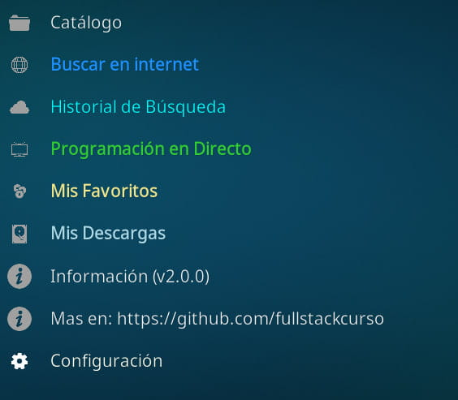
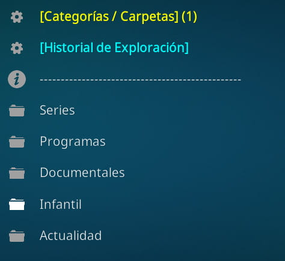

# AtresDaily - Addon para Kodi

 

## 📺 Descripción

**AtresDaily** es un addon para Kodi centrado en el catálogo de Α3рlаyer. Busca vídeos públicos disponibles en internet para cada contenido del catálogo.

### Características

- **Acceso Híbrido**: Reproduce directamente el contenido gratuito y ofrece la opción de buscar en internet cuando el contenido no está disponible
- **Gratuito y Seguro**: Sin registro obligatorio, sin publicidad, sin software malicioso
- **Explorador completo**: Series, Programas, Documentales, Infantil, Actualidad y Cine
- **TV en Directo**: Acceso rápido a la programación en vivo
- **Búsqueda Inteligente**: Motor optimizado para Dаіlуmоtіоn con soporte P2P experimental
- **Velocidad Extrema**: Sistema de caché inteligente para una navegación instantánea
- **Descargas**: Guarda tus vídeos favoritos para verlos offline
- **Gestión total**: Sistema propio de Favoritos y Copias de Seguridad (Backups)
- **Historial de Exploración**: Recuerda lo que has visto para retomarlo fácilmente
- **Categorías Personalizadas**: Crea tus propias carpetas para organizar el contenido
- **Historial de Búsqueda**: Accede rápidamente a tus búsquedas anteriores
- **Modo Offline**: Instantáneas del catálogo para navegar sin conexión
- **Filtros Anti-Trailers**: Evita clips cortos y encuentra capítulos completos (Modo Cine, Solo Recientes...)
- **Privacidad Responsable**: Solo se envía un identificador anónimo para contar instalaciones activas. Sin datos personales, sin seguimiento de uso

### ⚠️ Aviso Legal

- Este addon **NO aloja** ni distribuye contenido protegido.
- Funciona como un **buscador** que localiza contenidos ya disponibles públicamente en la red, sin saltarse ningún muro de pago.
- El desarrollador de este addon **NO se hace responsable** del uso que los usuarios hagan del mismo, ni del contenido que puedan encontrar a través de las búsquedas. El usuario es el único responsable de cumplir con las leyes de su país. Este addon se proporciona "tal cual", sin garantías de ningún tipo.

 

  
    
  

---

## 📥 Instalación

### Opción 1: Desde el Administrador de Archivos de Kodi (Recomendado)
Este es el método más sencillo ya que no requiere descargar archivos externos manualmente:

1. Abre Kodi y ve a **Ajustes** (icono del engranaje).
2. Entra en **Explorador de archivos** y selecciona **Añadir fuente**.
3. Haz clic en `<Ninguno>` y escribe la siguiente dirección: `https://fullstackcurso.github.io/atresdaily/`
   > ⚠️ **MUY IMPORTANTE:** Debes escribir **EXACTAMENTE** esta dirección terminada en `.io/atresdaily/`. **NO** copies la dirección que ves en la barra de tu navegador (github.com...), ya que esa no funciona en Kodi y te saldrá la carpeta vacía.
4. Dale un nombre a la fuente (por ejemplo: `atresdaily`) y pulsa **OK**.
5. Vuelve al menú principal, entra en **Add-ons** y haz clic en el icono de la **cajita abierta** (arriba a la izquierda).
6. Selecciona **Instalar desde archivo zip**.
   - *Nota: Si te sale un aviso de seguridad, ve a Ajustes y activa la opción "Orígenes desconocidos".*
7. Selecciona la fuente `atresdaily` y elige el archivo `repository.atresdaily-1.0.1.zip`.
8. Espera a que aparezca la notificación de "Add-on instalado" (esto instala el repositorio).
9. Ahora, en el mismo menú, selecciona **Instalar desde repositorio**.
10. Entra en **AtresDaily Repository** > **Add-ons de vídeo** > **AtresDaily** y pulsa **Instalar**.

### Opción 2: Instalación manual mediante archivo ZIP
1. Descarga el archivo `.zip` de la última versión desde la sección de **[Releases](../../releases)**.
2. En Kodi, ve a **Add-ons > Icono de la cajita > Instalar desde archivo zip**.
3. Busca en tu dispositivo el archivo descargado y selecciónalo para completar la instalación.

> ⚠️ **Primer Inicio:** Al abrir el addon por primera vez, verás un aviso legal (**cuyos puntos clave puedes consultar más abajo**). Para activarlo, **es obligatorio escribir la palabra "ACEPTAR"** (sin comillas). Sin este paso, el código permanecerá bloqueado y no realizará ninguna función.

## Contacto y Soporte

Si quieres informar de algún problema, realizar una consulta o apoyar este proyecto:

**Webs:**
- [FullStackCurso](https://github.com/fullstackcurso)
- [EspaKodi](https://github.com/espakodi)
- [LoioLoio](https://github.com/loioloio)

**Telegram:**
- [Canal EspaDaily](https://t.me/espadaily)
- [Canal EspaKodi](https://t.me/espakodi)

**Contacto directo:**
- [Telegram personal](https://t.me/rubensdfa1labernt)
- [Formulario](https://fullstackcurso.github.io/donaciones/#mensaje)

## 📋 Requisitos

- Kodi 19 (Matrix) o superior
- Conexión a internet
- No requiere dependencias complejas

---

### ⚠️ Aviso sobre Publicaciones y Crecimiento

- Los autores de AtresDaily **no desean** que se publiquen artículos, reseñas o tutoriales en blogs, periódicos digitales, revistas online, YouTube, Twitter/X, Facebook, Reddit, foros públicos ni TikTok u otros medios indexados sin autorización expresa.
- Este proyecto crece por recomendación directa entre usuarios.
- Te invitamos a compartir este addon con tus amigos y familiares, y a unirte a nuestra comunidad en Telegram, pero rogamos encarecidamente que no se le dé publicidad en medios masivos ni redes sociales abiertas.
- En este caso concreto preferimos un crecimiento orgánico.

### 📜 Puntos Clave del Aviso Legal

- Este software actúa como un **puente** entre Kodi y webs públicas, sin alojar contenido.
- Conforme a la jurisprudencia europea (Caso Svensson), enlazar a contenidos ya disponibles públicamente en la red no constituye una nueva comunicación al público.
- Uso de marcas comerciales solo con fines **informativos** (Fair Use), sin afiliación oficial.
- **Sin ánimo de lucro**: Gratuito, sin publicidad. Solo un identificador anónimo para contar instalaciones.
- El usuario es el único responsable de cumplir con las leyes de su jurisdicción.
- **Solo Interfaz**: El código aquí presente solo dibuja los menús; los vídeos vienen de conexiones externas.
- **Voluntad de Cooperación**: Disposición total para colaborar con los titulares de derechos para la retirada inmediata de enlaces específicos.
- **Prohibición Estricta de Comercialización**: Queda terminantemente **PROHIBIDA** la inclusión, distribución o instalación pre-configurada de este addon en dispositivos ("TV Boxes", "Kodi Boxes", Android TV, etc.) destinados a la venta o lucro comercial. Este proyecto no tiene fines de lucro ni genera ingresos de ninguna clase.
- **Sin Afiliación**: Este proyecto es independiente y no está afiliado ni avalado de ninguna manera por el equipo de Kodi o la Fundación XBMC.

---

*Addon desarrollado por fullstackcurso*
